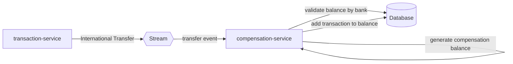

# Desafío de código Senior
Nuestro desafío te permitirá mostrarnos tus habilidades de codificación!!. También, es importante que te sientas a gusto con las tecnologías con las que debes desarrollar el desafío y no olvides que, **"tener un código correctamente estructurado y documentado habla bien de ti como desarrollador :blush:".**

***Mucha suerte!! :muscle:***

## Antes de desarrollar 
1. Para iniciar con tu desafío debes crear un **Fork** del repositorio.
2. Si ya finalizaste tu desarrollo, debes enviar un **Pull Request** con tu solución al repositorio principal.
3. Cada **commit message** que realices debe ser descriptivo y relacionado al desarrollo que has realizado.

## Problema
Dentro de una plataforma web, los usuarios pueden realizar transferencias internacionales para enviar divisas a diferentes usuarios en el extranjero. Cada transferencia internacional, genera un valor pendiente pago hacia la entidad financiera de destino que es la encargada de depositar el dinero en la cuenta del usuario de destino. Por este motivo, es necesario implementar un servicio que reciba eventos por streaming de nuevas transferencias internacionales y que a su vez genere balances de compensación diarios por cada banco a los cuales se les han realizado transferencias internacionales.

### Terminología
* ***balance de compensación:*** es un identificador único que engloba a su vez varios identificadores de transferencias internacionales y es único por cada banco y por cada grupo de transferencias diarias.

### Indicaciones
- Las clases y atributos a crear son a criterio del candidato evaluado, únicamente colocar los atributos que considere mas importantes teniendo como máximo 5 atributos por clase.
- La informacion debe ser almacenada en una base de datos ( puede utilizar la bdd que desee).
- Realizar las pruebas (unitarias, integración) que considere necesarias.
- Aplicar las practicas, patrones, estándares, etc que considere.
- Se debe gestionar los canales de comunicación de mensajes por streaming que vea necesarios.

### Servicios requeridos
- ***transaction-service:*** Este servicio debe suscribirse al servidor de streaming y publicar eventos de transacciones internacionales cada 5 segundos.
- ***compensation-service:*** Este servicio debe suscribirse al servidor de streaming y debe ser el encargado de generar identificadores de balances de compensación por banco y por día. También, deberá asociar los identificadores de transacciones a esté nuevo balance que está dividido por banco y por día.

### Funcionalidades
1. Incluir endpoints para poder consultar balances generales por bancos y por fechas
2. Se debe agregar una funcionalidad para que cada 24 horas se cierre un balance de compensación y se genere uno nuevo de forma automática con la primera transacción internacional del día siguiente.
3. Cada 24 horas se debe ejecutar un cron job para que el balance de compensación general se publique en un nuevo evento de streaming y el servicio encargado ejecute la compensación.

## Tecnologías
1. NodeJS v18+
2. NestJS Framework
3. TypeORM
4. Npm - Yarn - Pnpm
5. Swagger
6. Kafka
7. Docker
8. docker-compose
9. Test unitarios y funcionales
10. Test de carga